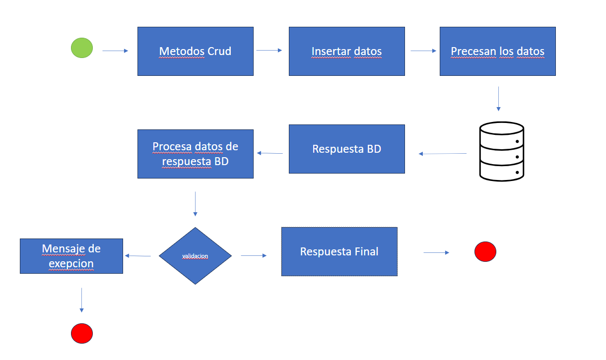

El siguiente proyecyo se realizo en spring boot con una base de datos H2 la cual al momento de ejecutar el proyecto
dicha base de datos se va a crear.

para ingresar a la DB se ingresa con el siguiente link "http://localhost:8080/h2-console"
 
Dentro del proyecto existe un archivo llamado "Pruebavaja.postman?collection.json" el cual estan los endpoint que se 
ocuparon para realizar las pruebas.

Dicho proyecto trabaja con JWT. Los token tienen una duracion de 1 minuto y 30 segundos el cual se puede realizar un 
cambio en la duracion en application.properties 

la linea de codigo para poder realizar el cambio es "security.jwt.expiration-time=90000" se dejara comentado en caso de 
pruebas para que dure 3 y 5 minutos dependiendo del usuario que realice la pruebas y quiera o necesite realizar el cambio

1.- Paso 1 Creacion de Usuario(POST)
    El usuario debe ingresar la informacion solicitadad por el microservico de crearUsuario que es nombre,email,contrase;a
    telefonos(que telefono contiene  numero,codigoCiudad y codigopais),
    Dicho servicio te entregara un id, una fecha de creacion de la sesion ,fecha de modificacion,fecha de ultimoLogin,
    token, activo (que es para validar que el jwt es valido) y un sesion que indica que el usuario esta activo en la sesion
    En caso que el usuario a registrar ya esta registrado en el sistema el sistema respondera "Usuario ya se encuentra registrado"

2.-Paso 2 Login(POST)
    El usuario debe ingresar con su correo electronico y su contraseña para poder intresar al servicio a su ves el servicio guarda
    la informacion de la ultima ves que se ingreso a la sesion en "ultimoLogin", en caso de que usurio no este 
    ingresado en bd el servicio respondera "Usuario no existe" en caso que la contraseña no sea valida "Contraseña incorrecta",
    si el tiempo de expiracion del token ya termino el el servicio respondera "El token ya no es valido", si el usuario ya esta
    dentro del sistema y se intenta ingresar nuevamente el servicio respondera "La sesion ya esta activa",

3.-Paso 3 logaut (POST)
    Para salir de la sesion solamente necesita el correo para validar que el usurio va salir de la session el servicio a su ves
    respondera la informacion del servicio y a su ves informando que la sesion ya no esta activa ("sesion:false") en caso de 
    volver a realizar el logout el servicio respondera "Usuario ya no esta dentro del sistema"

4.-Paso 4 Actualizar Usuario (PUT)
    -Este endpoint se puede realizar con el dentro y afuera de la sesion 
    Primero ingresamos la misma informacion que es para crear un usuario y poner en el endpoint el id del usuario a modificar
    , realizamos los cambios que el usuario solicite y enviamos 
    y este nos respondera lo mismo que crear Usuario pero solamente modificando la fecha y hora de "modificado" y actualizando el token

5.-Usuarios (GET)
    Para este servicio solamente se necesitara enviar el microservicio para poder recibir una lista de usuario 

6.- Eliminar Usuario
    Para eliminar usuario solamente necesitara el id del usuario en el endpoint para poder asi eliminarlo

Diagrama de solucion

